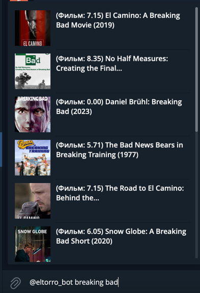

# GrIm - Grammar Improved
A [Radarr](https://github.com/Radarr/Radarr)/[Sonarr](https://github.com/Sonarr/Sonarr)/[Torrserver](https://github.com/YouROK/TorrServer) SelfHosted Telegram Bot featuring user authentication/level access.

## Features

### Sonarr

- Search for TV Shows by name.
- Pick which seasons you want to download.
- Choose which quality and language profile you want to download.
- [NEW] Choose Series Type.

### Radarr

- Search for Movies by name.
- Choose which quality profile you want to download.

### Improvements

- [NEW] Torrserver Support: you can add the series to Torrserver directly
- [NEW] Releases choosing: you can choose release manually from your tracker 
- [NEW] Inline usage for both series and movie searching through ant chat with the bot
- Better russian translating
- Dependencies upgrade

### Inline usage
- Just tap @bot ... and any query:
- 


## Requirements
### Running from source

- Go

## Configuration

- Copy the `config.json.template` file to `config.json` and set-up your configuration;

## Running it

### From source

```bash
$ go get github.com/zhark0vv/gim
$ cd $GOPATH/src/github.com/zhark0vv/gim
$ go run .
```

## TODO
- English translation